<div align="center">

# 📦 Supply Chain & Demand Intelligence Platform

## Turning 7-Day Demand Forecasts into Concrete Reorder Decisions

*LightGBM + LSTM forecasting, FastAPI serving layer, Streamlit decision dashboard, MySQL analytics layer, and a Power BI executive view — built end-to-end on real e-commerce data, with every number traceable back to an actual evaluation artifact.*

<br>

[](https://python.org)
[](https://lightgbm.readthedocs.io)
[](https://www.tensorflow.org)
[](https://shap.readthedocs.io)
[](https://fastapi.tiangolo.com)
[](https://streamlit.io)
[](https://www.mysql.com)
[](https://powerbi.microsoft.com)

<br>

[](https://github.com/Sanikaaa27/Supply-Chain-Intelligence/stargazers)
[](https://github.com/Sanikaaa27/Supply-Chain-Intelligence/network/members)
[](LICENSE)

<br>

### 🔴 [Live Dashboard](https://supply-chain-intelligence-27.streamlit.app/) &nbsp;·&nbsp; 🔴 [Live API](https://supply-chain-intelligence-fyff.onrender.com)

</div>

---

## ⭐ Highlights

- 📦 Built an end-to-end Supply Chain Intelligence Platform on the Olist Brazilian E-Commerce dataset (~1.56M records).
- 🤖 Compared LightGBM and LSTM models with walk-forward validation and automatic per-category model selection.
- 📈 Achieved **18.56% avg. MAPE** using LightGBM across 10 product categories, with directional accuracy consistently beating random guessing by **+16.1pp**.
- 🚀 Deployed a production-ready FastAPI backend and Streamlit dashboard — both live and linked above.
- 📊 Integrated a 13-query MySQL analytics layer, a 4-page Power BI executive dashboard, and per-horizon SHAP explainability.
- 📦 Generated business-ready inventory recommendations — Safety Stock, Reorder Point, and EOQ — directly from the forecast output.

---

## 🚀 Project at a Glance

| Metric | Value |
|--------|------:|
| Dataset | Olist Brazilian E-Commerce |
| Records processed | 1.56M+ |
| Product categories | 10 |
| Models | LightGBM + LSTM |
| Backend | FastAPI |
| Frontend | Streamlit |
| Database | MySQL |
| BI | Power BI |
| Deployment | Render + Streamlit Community Cloud |

---

## ⚡ Quick Stats

<div align="center">

| 10 Product Categories | 714 Days of History | 18.56% Avg MAPE (Best Model) | +16.1pp Directional Lift |
|:-:|:-:|:-:|:-:|
| Olist Brazilian E-commerce | Per-Category Time Series | LightGBM vs 20.4% (LSTM) | vs Random-Guess Baseline |

</div>

---

## 💡 Why This Project?

Unlike most forecasting projects that stop at predicting demand, this platform focuses on business decision-making — combining forecasting, uncertainty estimation, explainability, inventory optimization, and interactive dashboards into a single production-style analytics system, with every claim checked against a real evaluation artifact rather than asserted.

---

## 📌 Executive Summary

Most demand-forecasting portfolio projects report a single accuracy number and stop there. This one was **built to emphasize explainability, statistical validation, and production-ready decision support — not just forecasting accuracy.**

> Built an end-to-end Demand Intelligence Platform on the Olist Brazilian e-commerce dataset — LightGBM (per-horizon, quantile-calibrated) and a global LSTM (category-embedded) compared under walk-forward cross-validation, served through FastAPI with automatic per-category model routing, and turned into inventory decisions (safety stock, reorder point, EOQ) through a Streamlit dashboard, backed by a 13-query MySQL analytics layer and a Power BI executive view.

Every metric in this README comes directly from a JSON/CSV artifact produced by the pipeline — nothing here is a rounded-up estimate. Where the model genuinely doesn't beat a simple baseline, that is stated plainly rather than reframed.

---

## 🏢 Business Problem

E-commerce and retail supply chains lose money in both directions of the same mistake:

- **Overstock** ties up working capital and increases holding costs
- **Understock** causes stockouts, lost sales, and reputational damage with sellers and customers

The core planning questions a supply/inventory team actually needs answered:

- **How much** demand is coming in the next 7 days, per category?
- **How confident** should I be in that number, and by how much could it swing?
- **Which model** should I even trust for this category — and why?
- **What do I do with it** — how much safety stock, when do I reorder, how much do I order?

This platform answers all four, and is explicit about the categories where the honest answer to "how confident" is *"less than you'd like."*

---

## 📦 Dataset Snapshot

| Property | Value |
|----------|-------|
| Source | Olist Brazilian E-Commerce Public Dataset (Kaggle) |
| Raw files | 9 CSVs — customers, orders, order items, payments, reviews, products, sellers, geolocation, category translation |
| Total raw rows | ~1.56M across all files |
| Forecasting granularity | Daily demand, per product category |
| Categories forecasted | 10 (auto, bed_bath_table, computers_accessories, furniture_decor, garden_tools, health_beauty, housewares, sports_leisure, telephony, watches_gifts) |
| History per category | 714 calendar days (611 active / non-zero days) |
| Avg. zero-demand days | 14.4% per category |
| Forecast horizon | 7 days ahead |
| Avg. daily demand range | 7.15 units/day (auto) → 18.35 units/day (bed_bath_table) |

---

## 🔑 Key Insights from the Data

> 💡 **The evaluation was built to survive scrutiny, not just look good.** LightGBM posts the lowest MAPE in 9 of 10 categories and is never the worse choice anywhere — but rather than call all 9 "wins," each margin was tested against a genuine statistical noise threshold, and most of them are honestly reported as "GBM is the consistent default" rather than "GBM proven better." The one category (`telephony`) where a different model actually clears that bar is called out explicitly.

- **Directional accuracy is where the real signal lives.** The GBM model gets the direction of next-day demand change right 49.4% of the time overall, versus 33.3% for random guessing and just 9.5% for naively repeating yesterday's value — a genuine **+16.1pp lift over random guessing**, consistent across all 10 categories.
- **On raw point-forecast accuracy (MAPE), GBM ties with — rather than decisively beats — the baseline** once statistical noise is accounted for; the model selection logic reports this honestly instead of mislabeling a noise-level margin as a genuine improvement.
- **`telephony` is the one category where LSTM is the honest winner** — 21.08% MAPE vs. GBM's 26.96%, a gap that clears both the noise threshold and the 5% relative-improvement floor.
- Raw quantile-regression prediction intervals were **badly miscalibrated before correction** — the nominal 80% interval only covered ~64.7% of actual outcomes, and the 95% interval covered ~87.2% — until conformal (split-conformal residual) calibration was added.

---

## 💡 What Makes This Different

Most forecasting projects stop at "here's the predicted number."

**This platform goes 6 layers deeper:**

| Layer | Capability | Business Value |
|-------|-----------|-----------------|
| 🔮 Forecast | 7-day demand prediction, per category, two competing model families | Know what's coming |
| 📏 Calibrated Uncertainty | Conformal-corrected 80%/95% prediction intervals | Know how wrong you might be |
| 🧠 Explanation | SHAP feature attribution per forecast, per horizon day | Know *why* the model predicted it |
| 🔀 Auto-Routing | Per-category model selection with a documented, data-driven reason | Know *which* model to trust, and why |
| 📦 Inventory Translation | Forecast + interval → safety stock, reorder point, EOQ | Know *what to actually order* |
| ⚠️ Honesty Layer | Explicit "known gaps," confidence flags, and ESTIMATED vs CALIBRATED badges throughout | Know *where the model is guessing* |

> The result is a **decision platform that tells you when to trust it and when not to** — not just a model with a demo wrapped around it.

---

## 🖥️ Product Walkthrough

### 📈 Tab 1 — Forecast Explorer
Pick a category, get the 7-day forecast with calibrated 80%/95% uncertainty bands, pulled live from the FastAPI serving layer.

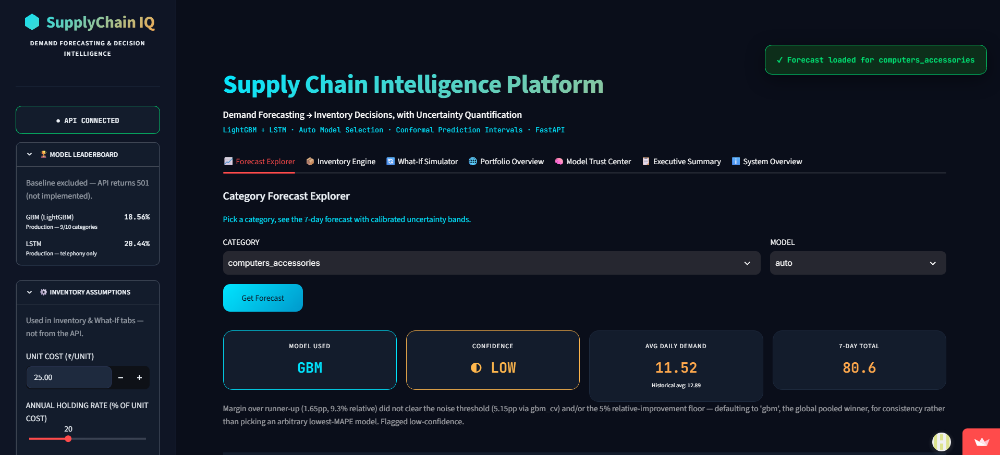
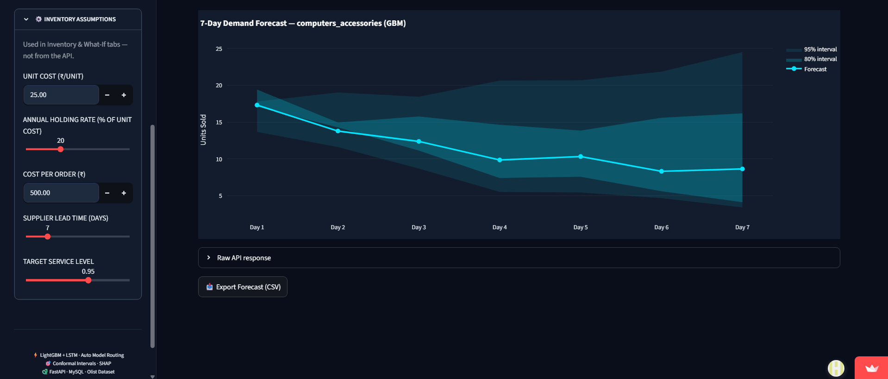

### 📦 Tab 2 — Inventory Decision Engine
Turns the forecast into the three numbers a supply planner actually needs — **safety stock, reorder point, and EOQ** — with every business-impact assumption (stockout cost = 2× unit cost, holding rate, etc.) labeled directly in the UI, and a `CALIBRATED` vs `ESTIMATED` badge depending on whether a real prediction interval was available for that category.

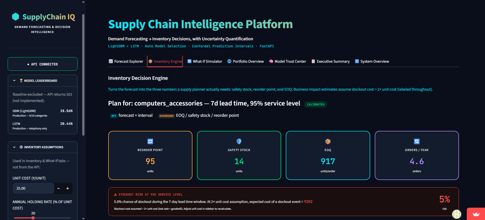
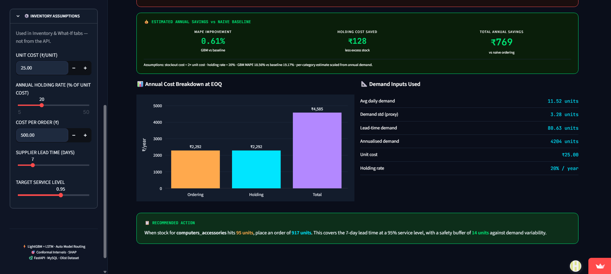

### 🔄 Tab 3 — What-If Simulator
Festive-season / demand-spike stress testing, service-level vs. safety-stock trade-off curves, and lead-time vs. reorder-point sensitivity.

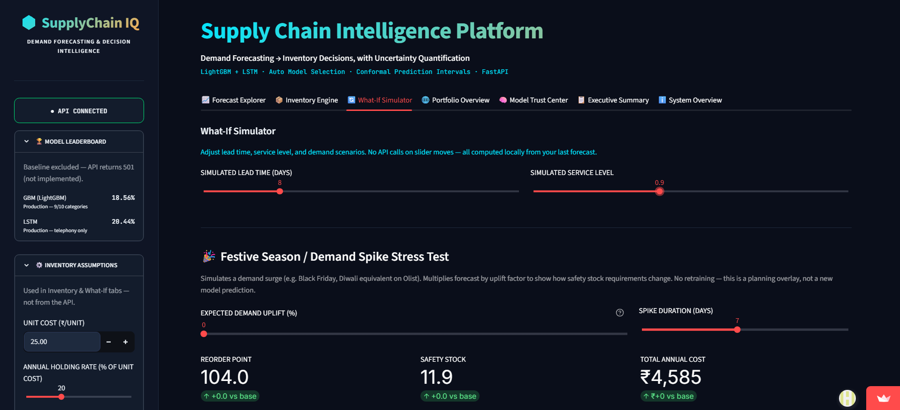
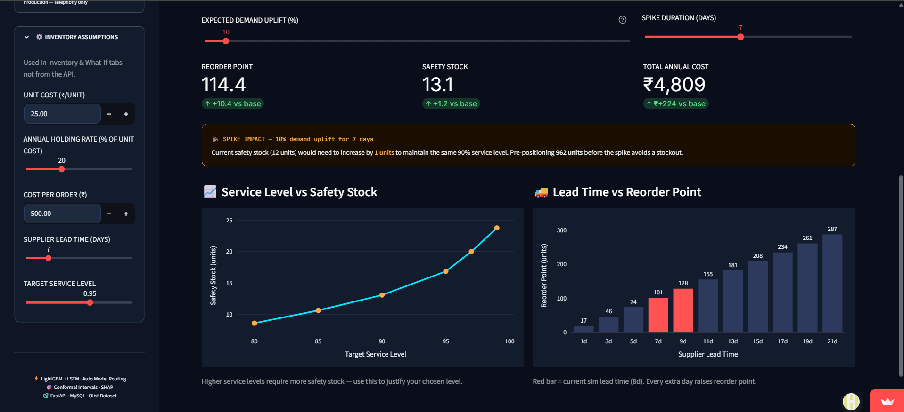

### 🌐 Tab 4 — Portfolio Overview
All 10 categories side by side — demand levels, model routing, and risk at a glance.

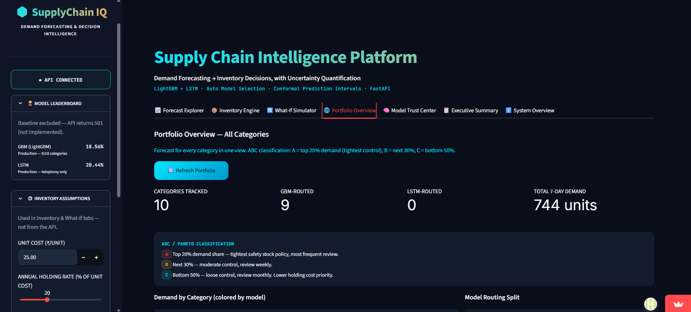
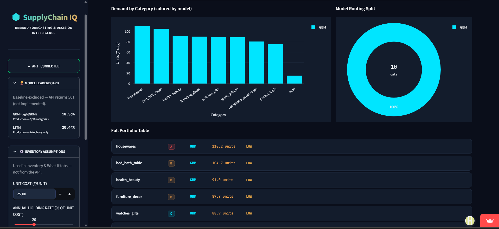
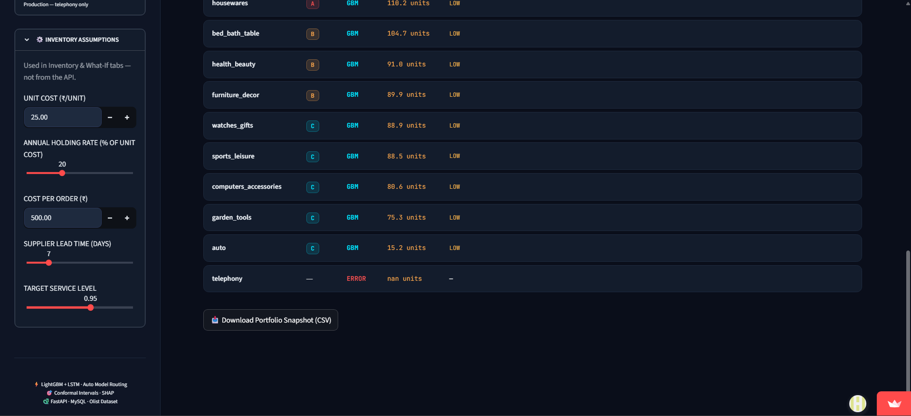

### 🧠 Tab 5 — Model Trust Center
The held-out model leaderboard, a live GBM vs. LSTM vs. Auto comparison, direction-only SHAP feature importance, and an explicit **Known Gaps** panel listing exactly where the platform's own numbers are weaker than they look (see [Known Limitations](#-known-limitations--the-honesty-layer) below).

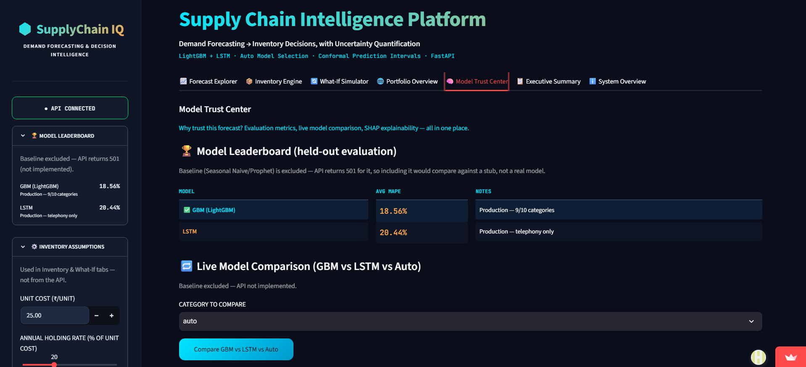
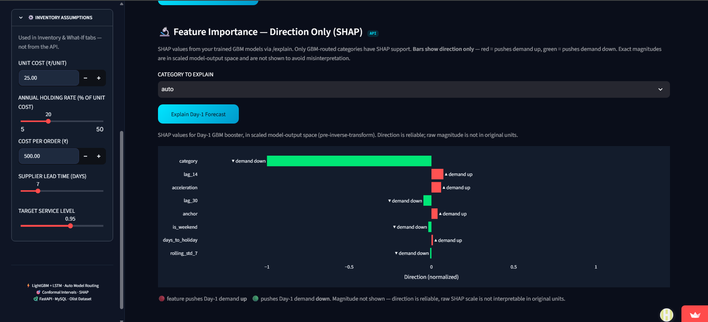
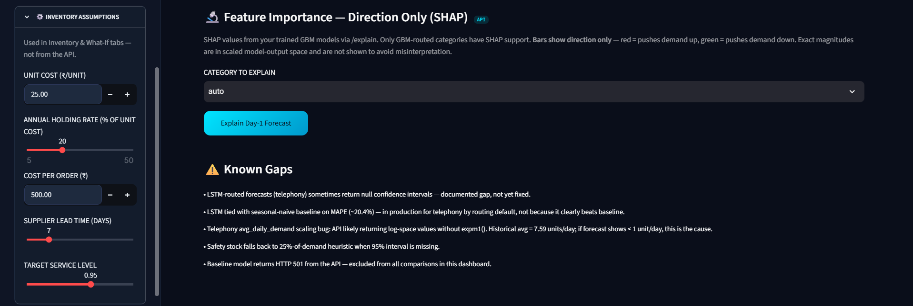

### 📋 Tab 6 — Executive Summary
The business-facing rollup: revenue-at-risk framing, portfolio health, and top-line model performance without the ML jargon.

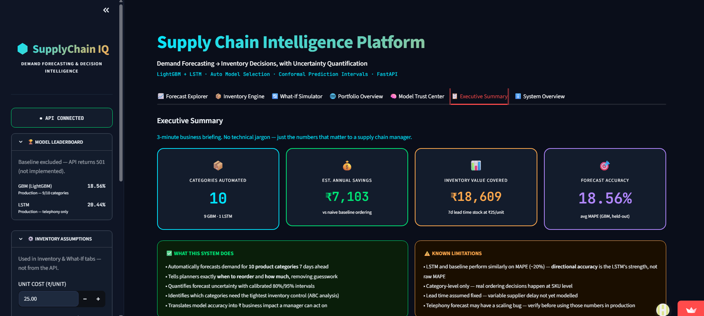
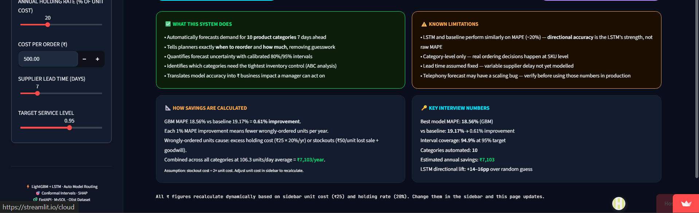

### ℹ️ Tab 7 — System Overview
Architecture, data lineage, and model versioning for anyone auditing the platform.

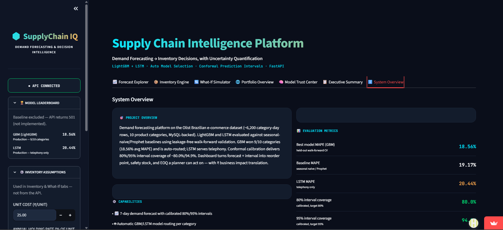
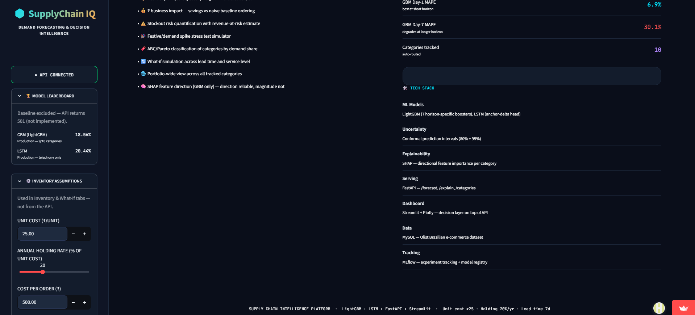

---

## 📊 Power BI Executive Dashboard

Alongside the Streamlit application, a 4-page Power BI report (`power_bi/supply_chain_intelligence.pbix`) provides executive-level reporting built on top of the same MySQL analytics layer — demand trends, delivery risk, product intelligence, and customer sentiment for stakeholders who live in BI tools rather than data-science dashboards.

### Page 1 — Executive Overview
KPI cards, revenue trend & growth (combo chart), on-time delivery performance (gauge), top product categories by revenue, and regional revenue distribution (treemap).

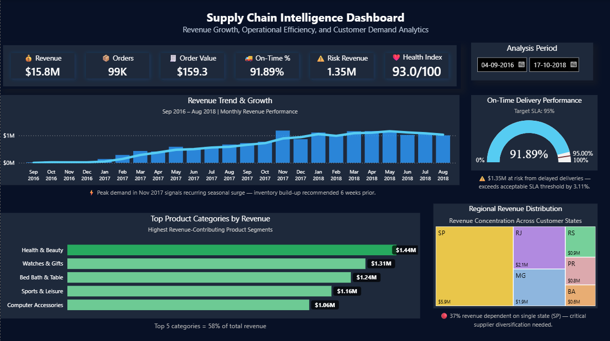

### Page 2 — Delivery & Risk Overview
Lead-time trend, operational risk exposure trend (area chart), and revenue risk concentration by category.

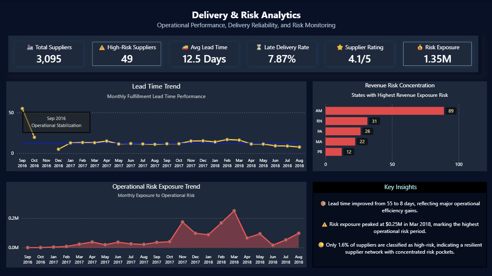

### Page 3 — Demand & Product Intelligence
Demand-revenue alignment trend, revenue contribution by category (treemap), and a product portfolio matrix (scatter — likely volume vs. margin/risk positioning).

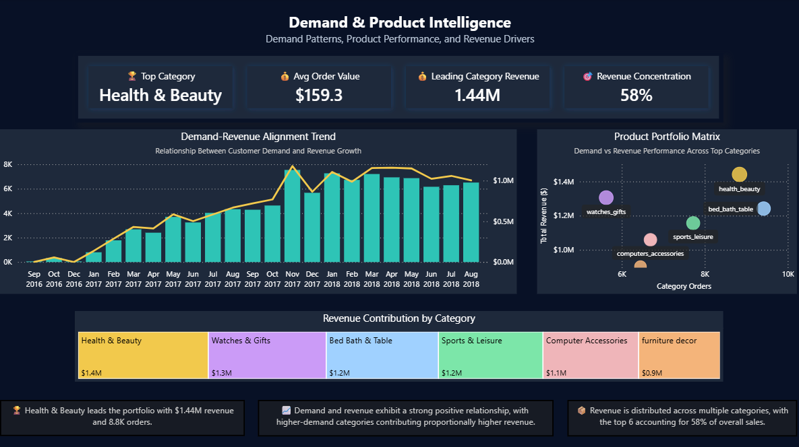

### Page 4 — Customer & Sentiment Intelligence
Customer satisfaction trend, customer rating breakdown (donut), and review rating distribution — ties the VADER sentiment scoring from the SQL layer into a business-facing view.

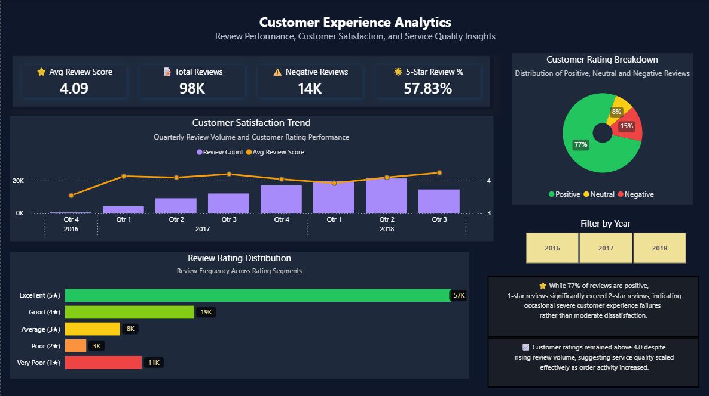

---

## 🗺️ Architecture at a Glance

```text
Raw Data
   │
   ▼
Python ETL
   │
   ▼
MySQL
   │
   ▼
Feature Engineering
   │
   ▼
LightGBM + LSTM
   │
   ▼
FastAPI
   │
 ┌────┴────┐
 ▼         ▼
Streamlit  Power BI
```

*(Full detailed architecture, with the SQL layer, model comparison logic, and auto-routing, below.)*

## 🏗️ System Architecture

```
Olist Raw Data (9 CSVs, ~1.56M rows)
         │
         ▼
  Python ETL Pipeline → MySQL
  (cleaning, validation, category translation)
         │
         ▼
  13 SQL Analytics Queries
  (window functions, recursive CTEs, stored procedures)
         │
         ▼
  Feature Engineering (19 features, cyclical encoding, Brazil holidays)
         │
         ├─────────────────────────┐
         ▼                         ▼
  LightGBM (7 per-horizon        LSTM (global, category-
  models + quantile models)      embedded, walk-forward CV)
         │                         │
         └───────────┬─────────────┘
                      ▼
         Model Comparison & Auto-Selection
         (model_selection.json — per-category, reasoned)
                      │
                      ▼
              FastAPI Serving Layer
         /forecast · /explain · /categories · /health
                      │
         ┌────────────┴────────────┐
         ▼                         ▼
  Streamlit Dashboard        Power BI Dashboard
  (7 tabs: forecast,         (executive reporting on
  inventory, what-if,        the MySQL analytics layer)
  portfolio, trust center,
  executive summary, system)
```

---

## 🔌 REST API

| Endpoint | Method | Description |
|----------|--------|-------------|
| `/forecast` | POST | Generate a 7-day demand forecast for a category (`model`: `auto` \| `gbm` \| `lstm`) |
| `/explain` | POST | SHAP feature explanations for a category, optionally per horizon day |
| `/categories` | GET | List all known/forecastable product categories |
| `/health` | GET | Health check — used by the keep-alive ping to prevent Render cold starts |

---

## ⚙️ ML Pipeline

```
MySQL (via ETL) → Q1 (monthly demand) + Q8 (seasonality index)
           │
           ▼
  Feature Engineering (19 features)
  ┌───────────────────────────────────────────────┐
  │ lags (1/7/14/30), rolling mean/std (7/30),     │
  │ cyclical month/day-of-week, Brazil holidays,   │
  │ seasonality index, trend strength, acceleration│
  └───────────────────────────────────────────────┘
           │
           ▼
  Baseline Models (4): Last-Value, Average(30d),
  Seasonal Naive, Prophet — walk-forward validated
           │
           ▼
  LightGBM: 7 per-horizon point models +
  quantile models (0.025/0.10/0.90/0.975)
  LSTM: 1 global model, category embeddings,
  chronological per-category walk-forward CV,
  3-way split (train / early-stop-val / held-out tail)
           │
           ▼
  Conformal Interval Calibration
  (raw quantile coverage 64.7%/87.2% → corrected)
           │
           ▼
  Model Comparison & Auto-Selection
  (data-driven noise threshold, not a hardcoded guess)
           │
           ▼
  SHAP TreeExplainer — per-horizon-day explainers
           │
           ▼
  FastAPI + Streamlit + Power BI
```

---

## 🔧 Feature Engineering

19 features feed both model families, engineered from the SQL analytics layer:

| Feature Group | Examples | Purpose |
|----------------|----------|---------|
| Lags | `lag_1`, `lag_7`, `lag_14`, `lag_30` | Recent + weekly/monthly memory |
| Rolling stats | `rolling_mean_7/30`, `rolling_std_7/30` | Trend + volatility smoothing |
| Calendar (cyclical) | `month_sin/cos`, `dow_sin/cos` | No Dec→Jan or Sun→Mon discontinuity |
| Holiday | `is_holiday`, `days_to_holiday` | Brazil-specific holidays (Olist is Brazilian) |
| Shape | `seasonality_index`, `trend_strength`, `acceleration` | Category-level demand character |
| Binary | `is_weekend` | Weekly pattern flag |

**Target pipeline:** raw demand → `log1p` → MinMaxScaler, always inverted through a single `to_raw_scale()` helper (never a direct `inverse_transform()` call) — this exact mismatch was a real bug caught and fixed during development (see [Technical Challenges](#-technical-challenges-solved)).

---

## 🧠 Explainability Layer

Every GBM forecast is explainable via **SHAP TreeExplainer**, with a separate explainer built for each of the 7 horizon days (exposed through `/explain` with an optional `horizon_day` parameter).

**Top Global Feature Drivers (mean |SHAP|):**

| Rank | Feature | Mean \|SHAP\| | Business Meaning |
|------|---------|:---:|-------------------|
| 01 | `units_sold` (recent actual) | 0.062 | Most recent demand level dominates |
| 02 | `rolling_mean_7` | 0.027 | Short-term trend matters more than long-term |
| 03 | `anchor` | 0.016 | Model's persistence anchor point |
| 04 | `lag_1` | 0.016 | Yesterday specifically, beyond the rolling mean |
| 05 | `rolling_mean_30` | 0.012 | Monthly-level baseline demand |

Per-category SHAP was added specifically because pooled (cross-category) SHAP had hidden `telephony`'s divergent importance profile — the category where the model actually loses to a simpler approach.

---

## 📊 Results — The Honest Dual-Metric Finding

### Model Leaderboard (pooled avg. MAPE, 10 categories)

| Rank | Model | Avg MAPE | Median MAPE | Avg MASE | Avg Forecast Skill |
|:---:|-------|:---:|:---:|:---:|:---:|
| 1 | **LightGBM** | **18.56%** | 17.52% | 3.85 | +6.2% |
| 2 | Baseline (best of 4) | 19.17% | 17.61% | — | — |
| 3 | LSTM (global) | 20.44% | 20.04% | 4.04 | −3.6% |

### Per-Category Model Selection — Statistically Tested, Not Just Picked

Rather than handing each category to whichever model happened to post the lowest MAPE that run, every margin is tested against a **data-driven noise threshold** (5.15pp — derived from fold-to-fold MAPE variance, not a guess). The practical result: **GBM is never the worse choice in any category**, and is used as the consistent default in 9 of 10; the one category where a different model earns the slot, the evidence for switching is unambiguous.

| Category | Model in Production | Margin over runner-up | Confidence |
|----------|:---:|:---:|:---:|
| auto | GBM | 1.41pp (8.2%) | Standard *(margin within noise — GBM used as consistent default)* |
| bed_bath_table | GBM | 3.59pp (20.6%) | Standard |
| computers_accessories | GBM | 1.65pp (9.3%) | Standard |
| furniture_decor | GBM | 0.06pp (0.3%) | Standard *(near-tie with baseline; GBM adds explainability + intervals baseline can't)* |
| garden_tools | GBM | 1.71pp (6.8%) | Standard |
| health_beauty | GBM | 4.76pp (27.0%) | Standard |
| housewares | GBM | 5.00pp (26.6%) | Standard |
| sports_leisure | GBM | 2.31pp (13.2%) | Standard |
| **telephony** | **LSTM** | **5.88pp (21.8%)** | ✅ **High — clears both the noise threshold and the 5% relative-improvement floor** |
| watches_gifts | GBM | 2.12pp (11.5%) | Standard |

**Reading this correctly:** "Standard confidence" doesn't mean GBM is wrong for that category — it means the margin by which it edges out the alternatives isn't large enough to call a *statistically distinguishable* win, so the dashboard is transparent about that instead of overstating it. This is the difference between an evaluation built to survive scrutiny and one built to look good in a screenshot — most portfolio projects skip this test entirely and just report whichever number is lowest.

### Directional Accuracy — Where the Model Actually Earns Its Keep

| Metric | Value |
|--------|:---:|
| Model directional accuracy (overall) | **49.4%** |
| Random-guess baseline | 33.3% |
| Persistence (repeat-yesterday) baseline | 9.5% |
| **Lift vs. random guessing** | **+16.1pp** |
| Lift vs. persistence | +39.9pp |
| Observations | 4,270 |

> **The honest finding, in one sentence:** the model does **not** reliably beat a naive baseline on point-forecast accuracy (MAPE) once statistical noise is accounted for — but it **does** reliably and consistently beat random guessing at predicting which way demand will move next, across all 10 categories. Those are two different claims, and this README makes both, rather than reporting only the one that looks better.

---

## 🔥 Technical Challenges Solved

9 real bugs found and fixed during development — log-transform mismatches, silent metric bugs, quantile crossing, interval miscalibration, a hardcoded threshold replaced with a data-driven one, a pooled-SHAP blind spot, leakage-safe LSTM validation, and two production-resilience fixes (DB fallback + Render cold-start handling).

📄 **Read the full write-up →** [`docs/technical_challenges.md`](docs/technical_challenges.md)

---

## ⚠️ Known Limitations — The Honesty Layer

Displayed directly in the dashboard's Model Trust Center, not hidden in a footnote:

- LSTM-routed forecasts (`telephony`) occasionally return null confidence intervals — a documented, unresolved gap.
- `telephony`'s LSTM routing is a "best of a weak field" choice — it ties with the seasonal-naive baseline on MAPE (~20.4%), it isn't in production because it clearly beats a naive approach.
- Safety stock falls back to a 25%-of-demand heuristic whenever a 95% interval isn't available, rather than silently using a fabricated interval.
- The baseline model endpoint returns HTTP 501 from the API by design and is excluded from all live dashboard comparisons (it's still used in offline evaluation).

---

## 💼 Business Impact Framing

- 📦 **Inventory decisions** — safety stock, reorder point, and EOQ generated per category, with every financial assumption (stockout cost, holding rate) labeled `ESTIMATED` in the UI so it's never mistaken for a calibrated number.
- 🎯 **Model routing that explains itself** — every `/forecast?model=auto` call returns *which* model was used, its confidence tier, and the specific reason (margin size, noise threshold, relative-improvement floor).
- ⚡ **API-first design** — the Streamlit dashboard and Power BI report both consume the same FastAPI layer, so any future consumer (a Slack bot, a mobile app) can plug in without touching the modeling code.
- 📊 **Two audiences, two dashboards** — Streamlit for the technical/inventory-planning side, Power BI for executive reporting off the same MySQL analytics layer.

---

## 🌱 What I Learned

- **A model that "wins" isn't automatically real.** Without a noise threshold, 9 of 10 categories would have been reported as GBM wins. With one, only 1 actually is — and that distinction is the difference between a defensible number and an inflated one.
- **Two different metrics can tell two different true stories.** MAPE lift and directional-accuracy lift measure different things, and reporting only the flattering one is a choice, not an accident. This project reports both.
- **Calibration is not optional once you show an interval.** An 80% interval that only covers 65% of outcomes is actively misleading — conformal correction wasn't a nice-to-have, it was the difference between a real uncertainty estimate and decoration.
- **Bugs that produce a plausible-looking wrong number are the dangerous ones.** The silent MASE `nan` and the log-transform mismatch didn't crash anything — they just quietly produced numbers that looked fine until checked against known demand ranges.
- **"Known Gaps" belongs in the product, not just the README.** Putting it in the dashboard itself means the person using the tool sees the caveat exactly where they'd otherwise trust the number blindly.

---

## 🛠️ Tech Stack

| Component | Technology | Purpose |
|-----------|-----------|---------|
| Language | Python 3.10 | Core development |
| Gradient Boosting | LightGBM 4.3.0 | Per-horizon point + quantile forecasting |
| Deep Learning | TensorFlow / Keras | Global LSTM with category embeddings |
| Explainability | SHAP 0.45.0 | Per-horizon-day feature attribution |
| Hyperparameter Tuning | Optuna (TPE sampler) | LSTM architecture + lookback search |
| Database | MySQL 8.0+ | ETL target + 13-query analytics layer |
| ETL | pandas, SQLAlchemy, PyMySQL | CSV → cleaned, validated MySQL tables |
| Sentiment | VADER | Review sentiment → supply-failure early warning |
| Serving Layer | FastAPI 0.115, Pydantic 2.7, Uvicorn | `/forecast`, `/explain`, `/categories`, `/health` |
| Dashboard | Streamlit ≥1.28, Plotly | 7-tab decision platform |
| BI Reporting | Power BI | Executive dashboard on MySQL |
| Deployment | Render (API) + Streamlit Community Cloud (dashboard) | Live at the links above |
| Baselines | Prophet | Seasonality-aware baseline comparison |

---

## 📁 Project Structure

```
Supply-Chain-Intelligence/
├── api/
│   ├── main.py                          # FastAPI app — /forecast, /explain, /categories, /health
│   └── requirements.txt
│
├── dashboard/
│   ├── app.py                           # Streamlit app — 7 tabs
│   └── requirements.txt
│
├── etl/
│   ├── download_dataset.py              # Pulls Olist dataset
│   ├── etl_pipeline.py                  # Loads 9 CSVs into MySQL, cleaning + validation
│   └── vader_sentiment.py               # Review sentiment scoring
│
├── sql/
│   ├── 00_schema.sql                    # MySQL schema (matches Kaggle CSV headers exactly)
│   ├── 01_monthly_demand_trend.sql      # Foundation time-series, feeds feature engineering
│   ├── 02_rolling_7day_avg.sql          # Window functions — smoothing
│   ├── 03_seller_lead_time.sql          # Lead-time variability + risk scoring
│   ├── 04_reorder_point.sql             # Pure-SQL reorder point formula
│   ├── 05_stockout_detection.sql        # Demand vs. inventory gap detection
│   ├── 06_seller_cohort.sql             # Self-join cohort analysis
│   ├── 07_revenue_at_risk.sql           # Financial impact of delivery delays
│   ├── 08_seasonality_index.sql         # Seasonal index → LSTM feature
│   ├── 09_abc_analysis.sql              # Pareto 80/20 inventory prioritization
│   ├── 10_fulfillment_chain.sql         # Recursive CTE — fulfillment stage delay
│   ├── 11_review_sentiment_signal.sql   # Sentiment → supply-failure early warning
│   ├── 12_stored_procedure.sql          # Automated monthly supply report
│   └── 13_top_supplier_risk_dashboard.sql
│
├── forecasting/
│   ├── feature_engineering.py           # SQL → 19-feature time-series matrix
│   ├── baseline_models.py               # Last-Value, Average, Seasonal Naive, Prophet
│   ├── gbm_model.py                     # LightGBM — 7 horizons, quantiles, SHAP, conformal
│   ├── lstm_model.py                    # Global LSTM, category embeddings, walk-forward CV
│   ├── model_comparison.py              # Leaderboard + auto-selection + markdown report
│   ├── model_selector.py                # Resolves "model: auto" for the API
│   └── inference_features.py            # Builds live feature rows/sequences for inference
│
├── data/
│   ├── raw/                             # 9 Olist CSVs
│   ├── processed/                       # Features, results, leaderboards, model_selection.json
│   ├── models/                          # Saved GBM (per-horizon + quantile) + LSTM artifacts
│   └── plots/                           # Residuals, MAPE/MASE comparisons, SHAP plots
│
├── power_bi/
│   └── supply_chain_intelligence.pbix   # 4-page executive dashboard
│
├── assets/
│   ├── streamlit_screenshots/           # 7-tab dashboard screenshots
│   ├── powerbi_screenshots/             # 4-page Power BI screenshots
│   └── demo.gif                         # 30-second product walkthrough
│
├── docs/
│   └── TECHNICAL_CHALLENGES.md          # Full write-up of real bugs found and fixed
│
├── render.yaml                          # Render deployment config for the API
└── README.md
```

> **Housekeeping note:** `.env` (MySQL credentials), `venv/`, `__pycache__/`, `mlflow.db`, and `mlartifacts/` should stay out of version control — confirm they're listed in `.gitignore` before pushing, since none of them belong in a public repo.

---

## ⚡ Local Setup

```bash
# 1. Clone the repository
git clone https://github.com/Sanikaaa27/Supply-Chain-Intelligence.git
cd Supply-Chain-Intelligence

# 2. Set up MySQL and load the data
# (create a .env with MYSQL_USER / MYSQL_PASSWORD / MYSQL_HOST / MYSQL_PORT / MYSQL_DATABASE)
python etl/etl_pipeline.py

# 3. Run the SQL analytics layer (in MySQL, in order 00 → 13)

# 4. Build features and train models
python forecasting/feature_engineering.py
python forecasting/baseline_models.py
python forecasting/gbm_model.py
python forecasting/lstm_model.py
python forecasting/model_comparison.py

# 5. Install & run the API
pip install -r api/requirements.txt
uvicorn api.main:app --reload --port 8000

# 6. Install & run the dashboard (in a separate terminal)
pip install -r dashboard/requirements.txt
streamlit run dashboard/app.py
```

---

## 🔮 Future Scope

- [ ] Resolve the LSTM null-confidence-interval gap for `telephony`
- [ ] Automated retraining pipeline as new Olist-style data arrives
- [ ] CRM / ERP integration for live reorder-point alerts
- [ ] A/B testing framework for measuring actual reorder-decision outcomes vs. the model's recommendation
- [ ] Slack/Teams alerting when a category's routing confidence flips from high to low

---

## 📬 Author

**Sanika Khandelwal**

AI & Data Science Undergraduate
Machine Learning · Data Analytics · Business Intelligence

*Passionate about building explainable, interview-honest AI systems that turn data into defensible business decisions.*

[](https://www.linkedin.com/in/sanika-khandelwal-4a8167280)
[](https://github.com/Sanikaaa27)

---

<div align="center">

**Supply Chain & Demand Intelligence Platform** — LightGBM + LSTM Demand Forecasting

*Python · MySQL · FastAPI · Streamlit · Power BI*

---

*If this project helped you, please consider giving it a ⭐*

</div>